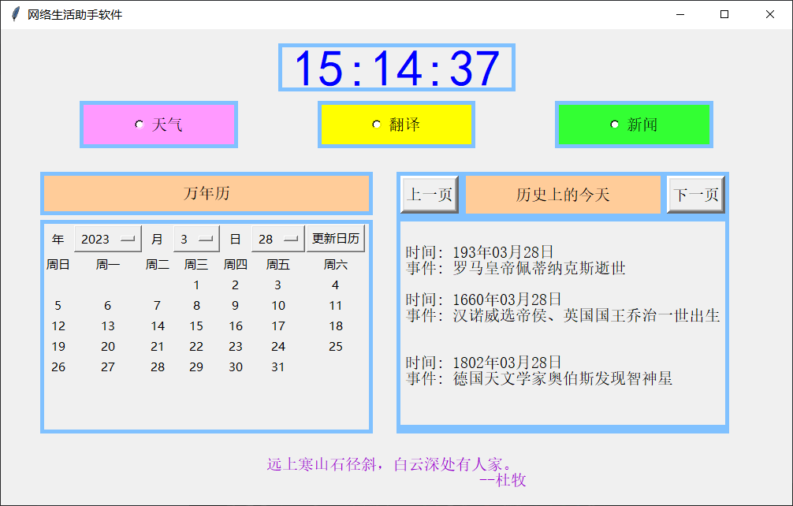

## Introduce

1. I come across a good idea that design a GUI which contain the basic functions when I use the network. 
2. I survey seven API companys, test their usability. Finally I choose three company and seven API. 
3. In order to reduce learning cost, I decide to use tkinter package rather than PyQT.
4. The GUI just a software which is integrated by various API.

  

## Start
Put the folder in your native and select your common IDE to open.  
`git clone https://github.com/Leetungkwan/Python_GUI`  

## Install
Install the only necessary package  
`pip install tkinter`

## Usage
run the `MainWindow.py` , and you will find this software is entire friendly

## Demo

- [**使用tinter包开发的软件介绍**](https://www.bilibili.com/video/BV18s4y1a7ZS/?share_source=copy_web&vd_source=723a64ac7cca4aa2535cb5b6f70d07ce)

## Version

- V1.0  finish the basic functions        2023/2/8
- V2.0  add other language(English) version  <u>**DOING NOW**</u>
